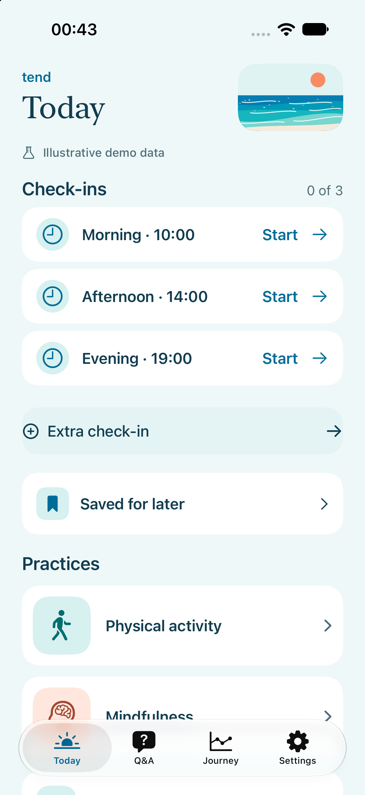
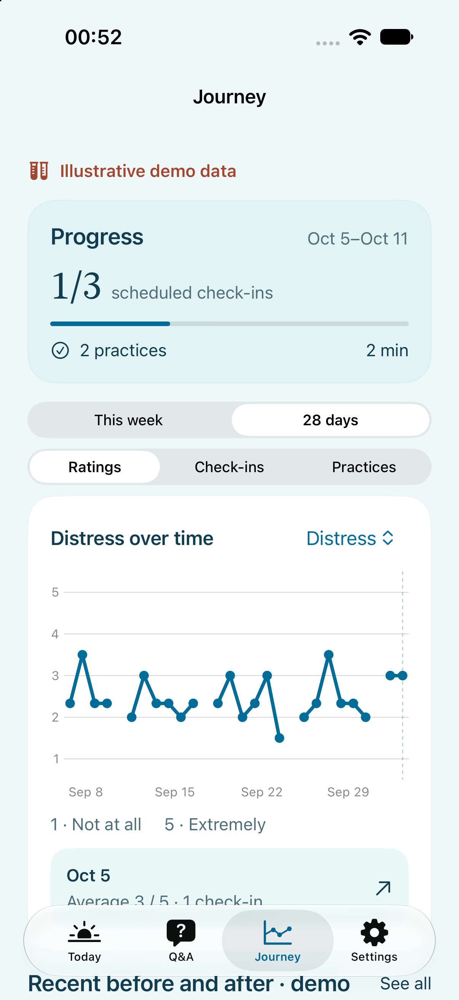

# Tend

Tend is a native SwiftUI iOS demo for brief wellbeing check-ins and guided movement or mindfulness practices. It stores records as local JSON and runs without an account or server.

<p>
  
  
</p>

Screenshots use the isolated demo mode with illustrative records. They show the start of a walkthrough and the history after two one-minute practices.

## What you can do

- Complete three scheduled check-ins each day, or start an extra check-in. Six questions cover distress, willingness, fatigue, pain, physical function, and available time.
- Choose from a movement option and a mindfulness option. Save suggestions for later, bookmark practices, skip, or repeat a previous practice.
- Follow written steps and spoken guides with a pausable timer. Completion is self-reported; helpfulness ratings and notes are optional.
- Explore daily ratings and practice history in Journey. Charts distinguish scheduled and extra check-ins and leave missing observations empty.
- Adjust reminder times, spoken guidance, and the Ocean or Forest theme. Review and export your local records.
- Walk through a simulated Fitbit connection and save support messages on the device.

## Install and run

Use a Mac with Xcode 27 or later and an installed iOS Simulator runtime. The app targets iOS 18 and later and uses Swift 6. The checked-in Xcode project includes its configuration, artwork, and audio; no account, API key, Python environment, or package download is needed to build the app.

```sh
git clone https://github.com/YangQiantwx/tend-ios.git
cd tend-ios
open Tend.xcodeproj
```

Select the **Tend** scheme, choose an installed iPhone simulator, and press Run. For a physical device, select your signing team and enable code signing in the target's build settings.

To build from the command line:

```sh
xcodebuild -project Tend.xcodeproj -scheme Tend \
  -destination 'generic/platform=iOS Simulator' \
  CODE_SIGNING_ALLOWED=NO build
```

`project.yml` is the XcodeGen project definition. After adding files or changing target settings, regenerate the project with `xcodegen generate`.

If command-line tools point to a standalone Command Line Tools installation, select the full Xcode app in **Xcode → Settings → Locations → Command Line Tools**. If a destination is unavailable, choose an installed device in **Window → Devices and Simulators**. Simulator builds do not require a signing team.

## Open a demonstration

From the checkout, run:

```sh
scripts/run_demo.sh
```

The script builds Debug, opens an installed iPhone Simulator, and launches Tend with a separate set of illustrative records. It finds Simulator or Device Hub inside the selected Xcode installation, reuses a booted iPhone when possible, and never downloads a runtime. To select a device, pass its UDID from `xcrun simctl list devices available`:

```sh
scripts/run_demo.sh SIMULATOR_UDID
```

The first demo launch creates sample history relative to the current date. Later launches keep your changes. To prepare fresh examples for a new demonstration, run `scripts/run_demo.sh --reset`; this resets only the demo records. It preserves ordinary app records and UI test fixtures. Build products go to a temporary cache; set `TEND_DEMO_BUILD_DIR` to use another build location.

For Xcode launches, add `--demo` under **Edit Scheme → Run → Arguments**. Add `--reset-demo-data` for one launch only when you want fresh sample history, then remove it. Remove both arguments to return to ordinary app data. These options are available only in Debug builds. Demo and UI test modes do not schedule system notifications; reminder preferences can still be saved locally.

## Run with Codex

Open this checkout in Codex and paste:

> Read README.md, check the installed Xcode and available iPhone Simulators, then build and open Tend using scripts/run_demo.sh. Preserve existing app and demo data. Use installed tools and runtimes; do not install large tools, enable paid services, or publish to the App Store. If signing, Xcode selection, or a missing runtime blocks the run, report the specific error and the smallest setup step needed.

## Tests

Run the core, app-state, persistence, scheduling, timer, and analysis tests with:

```sh
xcrun swift test
```

For UI tests, list the installed destinations and replace `SIMULATOR_UDID` with one of their simulator IDs:

```sh
xcodebuild -project Tend.xcodeproj -scheme Tend -showdestinations
xcodebuild test -project Tend.xcodeproj -scheme Tend \
  -destination 'platform=iOS Simulator,id=SIMULATOR_UDID' \
  -parallel-testing-enabled NO CODE_SIGNING_ALLOWED=NO
```

The UI tests use a separate `UITests` data directory. Their reset option does not erase ordinary or demo records. Xcode's scheme runs the UI suite; run the Swift package command separately for the core tests.

## Demo walkthrough

1. Demo mode opens on **Today**. An ordinary first launch starts with welcome screens; complete those first. Open a scheduled check-in and answer all six questions to see the two suggested practices.
2. Choose **Save for later**, return to Today, and reopen the suggestion from **Saved for later**. Suggestions expire after one hour in this demo; bookmarked practices remain saved.
3. Start a practice. Try pause and resume, then end it and record whether you completed it. Leave feedback blank or add a rating and note. Complete another practice from the same check-in to demonstrate both options.
4. Open **Journey** to inspect the new records, chart selections, and repeat-practice action.
5. Open **Settings → Fitbit**, connect the demo, and sync sample data. Disconnect to show the connection state change.
6. Open **Q&A → Ask the study team**. Write and save a message, reopen it, edit it, and try Share. Saving does not send a message; the system share sheet lets you choose a destination.
7. Open **Settings → Study data & export** to inspect and share a JSON snapshot.

Choose **28 days** in Journey to show the sample history. **This week** runs Monday–Sunday and contains only elapsed days; on Monday it may show one observed day. Start a new check-in before demonstrating **Save for later**, so the one-hour window is current. Practice completion is a deliberate self-report, and the recorded duration always reflects time actually spent with the foreground timer running.

## Data and configuration

`Tend/Resources/study-config.json` defines the reminder defaults, practice content, durations, and provisional suggestion rules. Changes are validated before loading. Existing reminder choices are retained when defaults change.

The app saves committed records to `study-data.json` and unfinished check-ins to `check-in-draft.json` inside its application container. Writes are atomic; the UI updates after a successful save. Exports contain the configuration, stored records, and a derived analysis snapshot with ISO 8601 timestamps. Draft answers remain separate from completed check-ins.

Records and support messages remain on the device. **Share JSON export** and **Share message** open the system share sheet; the chosen destination controls what happens next. Tend has no analytics uploader or background account service. Uninstalling the app removes its local container, so export records you need to keep first.

The suggestion rules, one-hour save window, practice scripts, and study schedule are demonstration settings. They are not an approved clinical protocol. Fitbit readings are synthetic, never collected from a device, and never used to choose practices. Support requests stay local unless you explicitly share them through another app; Tend has no delivery or reply service. Account sign-in, production research services, and exercise videos are not included. Observation labels in the data preview are descriptive calculations, not trained predictions or evidence of treatment benefit.

Notifications are local and require permission. The app schedules a rolling window of up to 20 days within the configured study period and refreshes it when opened. Scheduled requests do not establish delivery or reading.

The analysis preview uses seven preceding calendar days of scheduled responses to calculate a historical median; current and future answers are excluded. A same-day transition compares adjacent scheduled slots against the median frozen before the first response. Missing endpoints stay unknown. The demo uses week 1 to build history, weeks 2–6 as the development period, and weeks 7–8 as held out. These phase boundaries are implemented in `ResearchAnalysis.swift`; they do not train or evaluate a model.

## Code layout

| Directory | Responsibility |
| --- | --- |
| `Tend/App` | App lifecycle, navigation, committed state, and test fixtures |
| `Tend/Core` | Data models, rules, analysis, scheduling, and JSON persistence |
| `Tend/Design` | Theme tokens, shared controls, and vector artwork |
| `Tend/Features` | SwiftUI screens organized by feature |
| `Tend/Services` | Notifications and audio playback |
| `Tend/Resources` | App assets, configuration, and spoken guides |
| `Tests` | Core and Simulator UI tests |
| `scripts` | Simulator demo launcher, icon generation, and audio tooling |

## Integration points

| Area | Current contract and implementation |
| --- | --- |
| Records | `StudyRepository.load() throws -> StudyData?` and `save(_:) throws` are injected into `AppStore`. `JSONStudyRepository` is the default; `JSONDraftRepository` separately saves and recovers unfinished answers. |
| Suggestions | `RuleEngine(configuration:).recommend(for: EMAAnswers) throws -> [Practice]` returns one movement and one mindfulness option. The configuration supplies thresholds, content, and durations. Wearable readings are not an input. |
| Reminders | `ReminderPlan` and `SavedReminderPlan` produce dated plans. `ReminderService` and `SavedRecommendationReminder` apply them to `UNUserNotificationCenter`; authorization, scheduling failures, and rollback remain in the service layer. |
| Audio and timer | `PracticeTimer` tracks active elapsed time. `PracticePlayerModel` coordinates it with `PracticeNarrationPlayer`, which accepts a practice ID and script and wraps bundled audio or device speech. Playback failures and interruptions are reported to the player. |
| Wearables | `FitbitDemoConnection.sampleDays(at:)` produces `[WearableDay]` with optional metrics, timestamps, and a `synthetic_demo` source. `AppStore+Support` commits connect, sync, and disconnect state locally. There is no OAuth or Fitbit network client. |
| Support | `SupportRequest.prepared(...) throws` validates a local draft or saved request; `shareText` supplies the system share sheet. `AppStore+Support` persists changes. There is no delivery or reply contract. |
| Export | `StudyExport.write(to:) throws` validates the configuration and data and atomically writes the full JSON snapshot. `AppStore.exportURL()` prepares the file used by the share sheet. |

Real wearable synchronization needs an authorized Fitbit application and a provider that maps readings into `WearableDay` while retaining missing values, dates, and provenance. Support delivery needs an approved recipient/service and explicit sent, failed, and reply states; local save success must remain distinct from delivery. Neither integration currently makes network requests. Approved practice media and final study rules can replace the bundled configuration and recordings without replacing the UI flow; update the narration manifest when scripts change.

## Audio and licensing

The spoken guides use Pocket TTS with the licensed Alba stock voice. Bundled recordings play offline; a missing, invalid, or outdated recording falls back to the device voice. Generation instructions, model revisions, and voice attribution are in [the audio README](Tend/Resources/Audio/README.md). After setting up that Python environment, check audio coverage, script hashes, and AAC decoding on macOS with `../tend-audio-env/bin/python scripts/verify_audio.py`.

See [LICENSE](LICENSE) for the application code license. The generated audio has a separate [CC BY 4.0 license](Tend/Resources/Audio/CC-BY-4.0.txt); retain its attribution when redistributing it.
